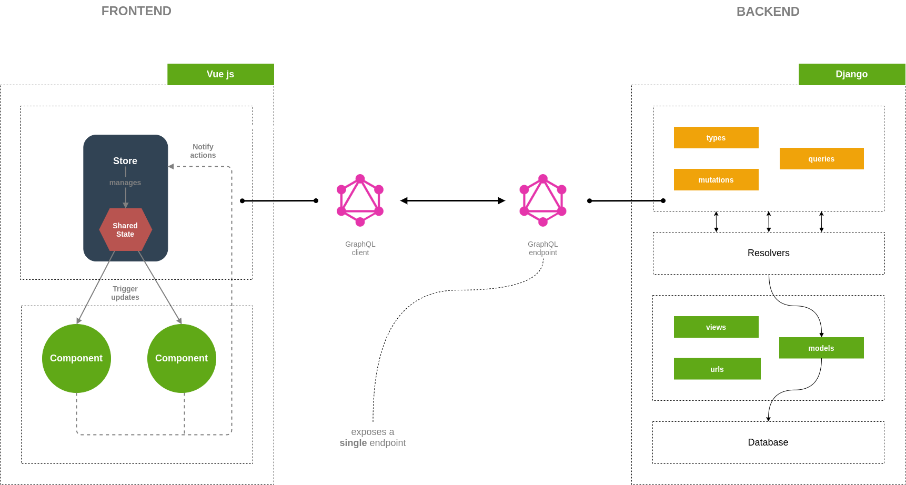
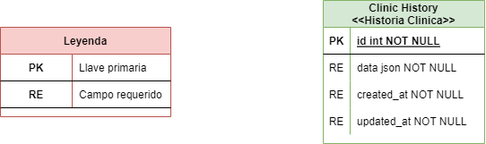

# Hackathon Yeapp 2022

Proyecto Salud sobre historia medica personal y digital.

Integrantes del proyecto
- David Garcia
- Daniel Mejía
- Cristian Ordoñez

---

## Tecnologías

- [Vue js](https://vuejs.org/)
- [Django](https://www.djangoproject.com/)
- [GraphQL](https://apollo.vuejs.org/)

---

## Arquitectura

---

## Base de Datos

---

## Extensiones para Visual Studio Code

### Front

- [Vetur](https://marketplace.visualstudio.com/items?itemName=octref.vetur)
- [VS Code Snippets](https://marketplace.visualstudio.com/items?itemName=sdras.vue-vscode-snippets)
- [Editor Config](https://marketplace.visualstudio.com/items?itemName=EditorConfig.EditorConfig)
- [Indent Rainbow](https://marketplace.visualstudio.com/items?itemName=oderwat.indent-rainbow)
- [Better Comments](https://marketplace.visualstudio.com/items?itemName=aaron-bond.better-comments)
- [Auto Rename Tag](https://marketplace.visualstudio.com/items?itemName=formulahendry.auto-rename-tag)
- [Bracket Pair Colorizer 2](https://marketplace.visualstudio.com/items?itemName=CoenraadS.bracket-pair-colorizer-2)

### Back
- [Python](https://marketplace.visualstudio.com/items?itemName=ms-python.python)
- [Pylance](https://marketplace.visualstudio.com/items?itemName=ms-python.vscode-pylance)
- [Editor Config](https://marketplace.visualstudio.com/items?itemName=EditorConfig.EditorConfig)
- [Indent Rainbow](https://marketplace.visualstudio.com/items?itemName=oderwat.indent-rainbow)
- [Better Comments](https://marketplace.visualstudio.com/items?itemName=aaron-bond.better-comments)

---

## Pasos para ejecutar las aplicaciones

### Front

1. Se recomienda utilizar **Node js 14.17** o superior
2. Instalar Vue CLI (command line interface) usando el comando `npm install -g @vue/cli`
3. Instalar las dependencias contenidas en **package.json** usando el comando `npm install` o `npm i`
4. Ejecutar el proyecto con `npm run serve`
5. Abrir el navegador e ir a la dirección <http://localhost:8080/> o <http://localhost:8081/>

### Back

1. Se recomienda utilizar **Python 3.6** o superior
2. Se recomienda utilizar [entornos virtuales](https://docs.python.org/es/3/tutorial/venv.html)
3. Instalar las dependencias contenidas en **requirements.txt** usando el comando `pip install -r requirements.txt`
4. Ejecutar el archivo **manage.py** con `python manage.py makemigrations`
5. Ejecutar el archivo **manage.py** con `python manage.py migrate`
6. Ejecutar el archivo **manage.py** con `python manage.py runserver`
7. Abrir el navegador e ir a la dirección <http://localhost:8000/> or <http://127.0.0.1:8000/>
